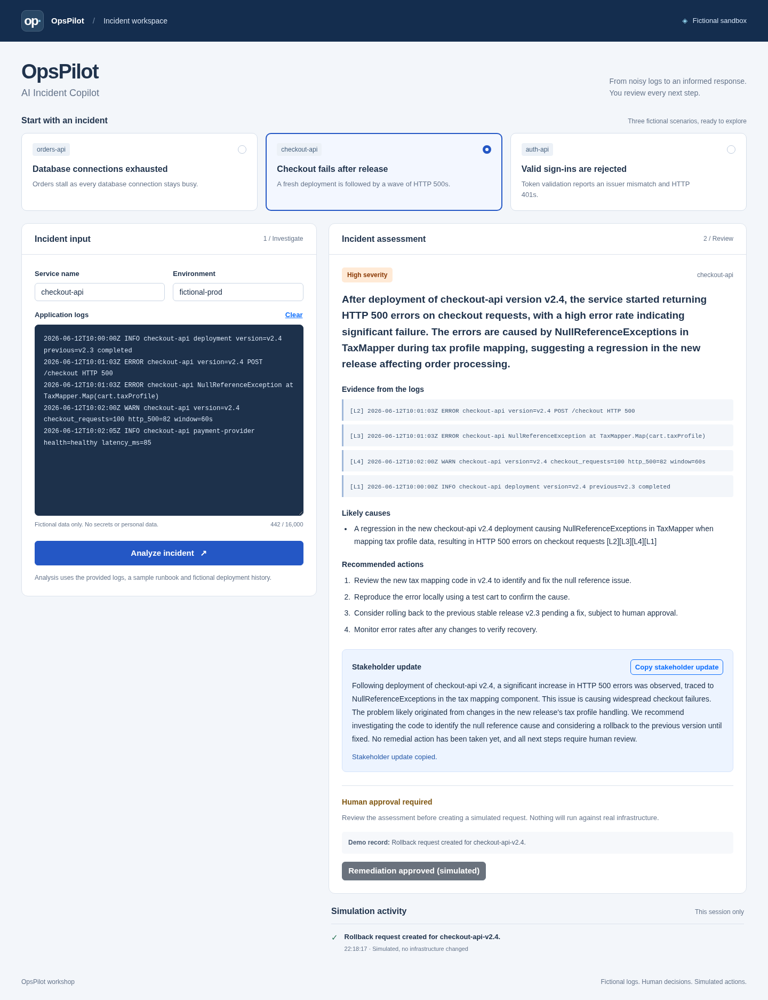
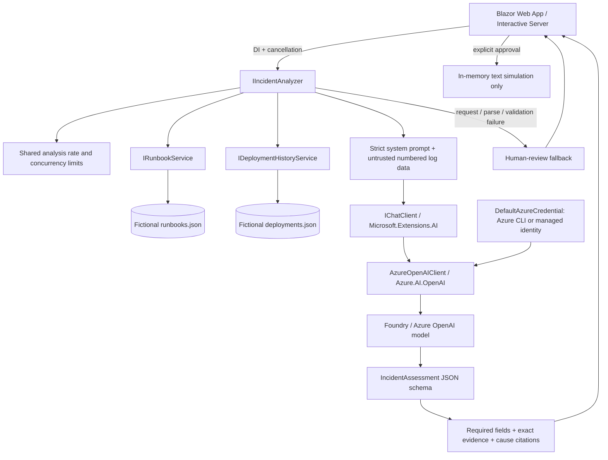

# OpsPilot

**AI Incident Copilot** — a complete .NET 8 workshop demo that turns fictional application logs into a structured, evidence-cited incident assessment using a Microsoft Foundry / Azure OpenAI model.

Choose one of three incidents, inspect the assessment, copy a stakeholder update, and approve a **simulation**. Approval only adds a text record to the current browser circuit. The app cannot roll back or change infrastructure.



## Quick start

Prerequisites: the latest patched **.NET 8 SDK**, Azure CLI, an Azure account with model inference access, and an existing Azure OpenAI chat model deployment that supports native JSON schema structured output. `gpt-4.1-mini` is a suitable workshop model. Use the deployment's name, which can differ from the model name. See Microsoft's [structured output support](https://learn.microsoft.com/en-us/azure/foundry/openai/how-to/structured-outputs).

From this folder:

```bash
az login
az account set --subscription '<subscription-id>'

# Discover existing accounts and their deployments. These commands do not retrieve keys.
az cognitiveservices account list --query "[?kind=='OpenAI' || kind=='AIServices'].{name:name,group:resourceGroup}" -o table
az cognitiveservices account deployment list -g '<resource-group>' -n '<account-name>' -o table

# Bash helper: validates the deployment and writes endpoint/deployment/tenant to user-secrets.
bash scripts/configure-azure.sh '<resource-group>' '<account-name>' '<deployment-name>'

dotnet restore OpsPilot.sln --locked-mode
dotnet build OpsPilot.sln --no-restore
dotnet test OpsPilot.sln --no-build
dotnet run --project src/OpsPilot.Web
```

Open **http://localhost:5188**. The launch profile uses the Development environment so user-secrets are loaded. The .NET 8 SDK is selected by `global.json`. `dotnet run` does not create any Azure resources.

### Manual user-secrets setup (Bash or PowerShell)

The project already has a `UserSecretsId`; no `init` is required.

```bash
dotnet user-secrets set AZURE_OPENAI_ENDPOINT 'https://YOUR-RESOURCE.openai.azure.com/' --project src/OpsPilot.Web
dotnet user-secrets set AZURE_OPENAI_DEPLOYMENT 'YOUR-DEPLOYMENT-NAME' --project src/OpsPilot.Web
# Optional, useful when the CLI account belongs to multiple tenants:
dotnet user-secrets set AZURE_TENANT_ID 'YOUR-TENANT-ID' --project src/OpsPilot.Web
```

Use the **Azure OpenAI resource root endpoint**, not a Foundry project URL or `/openai/v1/` URL. This app uses `AzureOpenAIClient` and its deployment-based Chat Completions API. `src/OpsPilot.Web/appsettings.example.json` documents the names with placeholders; it is not automatically loaded and should not be filled with credentials.

User-secrets live outside the project and are intended for development, not encrypted production storage. Do not commit credentials, `.env` files, or populated configuration files. No API keys are used. In deployed environments, supply the same setting names as application settings/environment variables. Environment variables take precedence over user-secrets. If running with `--no-launch-profile`, set `ASPNETCORE_ENVIRONMENT=Development` explicitly to load user-secrets locally.

### Azure roles

`DefaultAzureCredential` uses your Azure CLI login locally and a managed identity in Azure. The actual inference identity needs **Cognitive Services OpenAI User** on the model resource. Subscription Owner/Contributor management access alone does not grant the required model data-plane operation. See [Microsoft Entra authentication for Azure OpenAI](https://learn.microsoft.com/en-us/azure/foundry-classic/openai/how-to/managed-identity?view=foundry-classic).

An administrator with role-assignment permission can run this Bash example:

```bash
opspilot_scope=$(az cognitiveservices account show -g '<resource-group>' -n '<account-name>' --query id -o tsv)
opspilot_user=$(az ad signed-in-user show --query id -o tsv)
az role assignment create --assignee-object-id "$opspilot_user" --assignee-principal-type User --role 'Cognitive Services OpenAI User' --scope "$opspilot_scope"
```

Allow time for the role assignment to propagate before retrying inference. The setup helper does not grant roles, create deployments or retrieve keys. A 401/403 often indicates the selected identity, tenant, resource scope or role is incorrect. A 400 can indicate an incompatible model/schema; a 429 can indicate Azure quota exhaustion. The application logs HTTP status and exception type without raw response bodies or configuration values.

## Workshop materials

- [Detailed instructor walkthrough](docs/workshop/Workshop_Walkthrough.md): exact files, code highlights, talk track, timing, exercises and troubleshooting.
- [Editable PowerPoint](docs/workshop/OpsPilot_MSA_Workshop.pptx) and [PDF slides](docs/workshop/OpsPilot_MSA_Workshop.pdf).
- [Slide-by-slide presenter notes](docs/workshop/Presenter_Guide.md).
- Repository: https://github.com/Adarsh1999/OpsPilot

## Workshop walkthrough

1. Open OpsPilot and select **Database connections exhausted**. Inspect the pool `active=100`, `idle=0`, timeout and long transaction log lines. Click **Analyze incident** and follow the `[L#]` references from each cause back to evidence.
2. Select **Checkout fails after release**. Compare the `v2.4` deployment, HTTP 500s and `TaxMapper` exception. Discuss why a correlated release is a hypothesis, not proof of root cause.
3. Click **Copy stakeholder update**. Clipboard requires HTTPS or localhost; if unavailable, select the displayed text and copy manually.
4. Review the displayed demo record, then click **Approve remediation**. The session activity shows `Rollback request created for checkout-api-v2.4.` with an explicit simulation label. Repeated approval is disabled for that assessment. No rollback request is sent anywhere.
5. Select **Valid sign-ins are rejected**. Review expected versus actual fictional issuers and HTTP 401s. The prompt explicitly forbids recommending disabled issuer/signature validation.
6. Edit a sample or paste custom **fictional** logs and supply service/environment names. Unknown services simply have no fixture context. Editing any input clears the previous assessment and its approval state.
7. Demonstrate empty-input validation and cancellation. To demonstrate fallback without touching your setup, start another instance with an intentionally missing deployment using the command below. Fallback has no evidence/causes and cannot be approved.

```bash
# Bash: override only this process; the saved user-secrets remain unchanged.
AZURE_OPENAI_DEPLOYMENT=missing-workshop-deployment dotnet run --project src/OpsPilot.Web -- --urls http://localhost:5189
```

Custom inputs go to the configured Azure model. Use fictional data only, with no credentials or personal information. Authentication is deliberately absent, so use this as a controlled workshop demo, not a public incident portal.

## Architecture



The UI invokes `IIncidentAnalyzer` directly on the server; it does not call a custom REST analysis endpoint. Blazor's framework script maintains the server circuit. Bootstrap is bundled locally; the only custom JavaScript is a small clipboard module. No JavaScript UI framework is used.

| Location | Responsibility |
| --- | --- |
| `src/OpsPilot.Web/Models` | Exact request/assessment contracts, severity enum, fixture records |
| `Services/IncidentPromptBuilder.cs` | System policy and JSON-encoded incident/context payload; no configuration dependencies |
| `Services/FoundryIncidentAnalyzer.cs` | Context lookup, typed model request, timeout, validation, safe fallback |
| `Services/AzureChatClientFactory.cs` | `AzureOpenAIClient` + `DefaultAzureCredential` exposed through `IChatClient` |
| `Services/AssessmentSafety.cs` | Evidence/citation integrity checks and conservative fallback |
| `Services/FixtureServices.cs` | JSON-backed runbooks, deployment history and scenario loading |
| `Services/AnalysisGate.cs` | Shared fixed-window and concurrency limits |
| `Services/RemediationSimulation.cs` | Deterministic text-only approval record, no external dependencies |
| `Components/Pages/Home.razor` | Scenario selection, input, progress, assessment and session activity |
| `Components/Shared/AssessmentPanel.razor` | Result rendering, clipboard and approval controls |
| `Fixtures` | Three fictional incidents, runbooks and deployment history |
| `tests/OpsPilot.Tests` | Offline contract/resilience/host tests and explicit opt-in live Azure test |

### Context today, function tools later

`IRunbookService.GetRunbookAsync(serviceName, cancellationToken)` and `IDeploymentHistoryService.GetRecentDeploymentsAsync(serviceName, cancellationToken)` return typed, read-only data. Today the analyzer calls them directly and includes the results in its prompt. They can later be wrapped as Foundry function tools without changing the fixture contracts. No tools or agent loops are registered in this version.

### Reliability boundaries

- **Native structured output:** `GetResponseAsync<IncidentAssessment>(..., useJsonSchemaResponseFormat: true)` requests a generated JSON schema. All seven properties are required; unknown properties, null/invalid fields and incomplete responses are rejected. Packages are pinned in the project files and `packages.lock.json`. The integration follows Microsoft's [.NET structured output pattern](https://learn.microsoft.com/en-us/dotnet/ai/quickstarts/structured-output).
- **Grounding:** every evidence entry must match an original numbered log line exactly. Each cause must cite an ID in accepted evidence. This verifies citation integrity, not whether a model's reasoning is true. Human review remains required. Runbooks and deployment history are explicitly context, not proof.
- **Failure behavior:** request, parsing, schema, grounding and fixture failures return a clearly labeled fallback. `High` is its conservative **review priority**, explicitly not an inferred incident severity. No evidence or causes are invented. Approval is disabled without verified evidence.
- **Cancellation:** a 60-second budget covers context and inference; caller cancellation propagates. Model retries are disabled so the SDK does not silently multiply requests. The dashboard supports Cancel and cancels when its component is disposed.
- **Limits:** at most 16,000 log characters / 200 lines; service 80 and environment 40 characters, both restricted to simple identifiers. At most 10 analysis attempts per minute and 2 concurrent analyses **per app process**, shared across all Blazor circuits. The SignalR message limit is 128 KiB so valid Unicode log input fits the transport. An additional 120 requests/minute limit covers mapped Blazor HTTP endpoints. `/health` remains available. These are basic workshop controls, not per-user quotas or distributed protection.
- **Exceptions and logging:** HTTP exception handling and an interactive error boundary show generic errors. Logs contain generated analysis IDs, character counts, elapsed time, severity, exception type and HTTP status only. They do not contain input logs, model output, endpoints, tenant IDs, deployment settings, credentials or raw SDK exceptions. SDK content logging and verbose circuit errors are disabled.
- **State:** approvals are limited to the assessed input, one per assessment, with the most recent 20 records kept in that circuit. Refreshing or losing the circuit clears them. The model's approval flag is always overridden to `true`. Model text never becomes an executable command.
- **Health:** `GET /health` returns `Healthy` for process liveness; it does not prove Azure authentication/model readiness or perform a billed inference. The live test below checks actual model access.

## Verification

```bash
dotnet build OpsPilot.sln
dotnet test OpsPilot.sln
# Explicitly opt in; uses Azure user-secrets/DefaultAzureCredential and consumes model tokens.
OPSPILOT_LIVE_TESTS=1 dotnet test OpsPilot.sln --filter Category=LiveAzure
# PowerShell alternative:
# $env:OPSPILOT_LIVE_TESTS='1'; dotnet test OpsPilot.sln --filter Category=LiveAzure

dotnet publish src/OpsPilot.Web -c Release -o artifacts/publish
curl --fail http://localhost:5188/health
```

The live test is skipped by default; offline tests require no Azure access. The live test exercises all three scenarios through the real analyzer and fails if a fallback or ungrounded assessment is returned. Model wording can vary; tests check contracts and grounding instead of exact prose.

## Optional Azure deployment

The application is ready to publish to an ASP.NET Core host. For an Azure App Service workshop deployment, use a current .NET 8 Linux runtime, one instance, a system-assigned managed identity and HTTPS. Set session affinity and enable WebSockets for the server circuit as appropriate for the chosen App Service platform. See [hosting server-side Blazor](https://learn.microsoft.com/en-us/aspnet/core/blazor/host-and-deploy/server?view=aspnetcore-8.0).

The following Bash commands are **optional deployment guidance**. They create billable resources when you run them; the demo's remediation button cannot invoke them. Choose your own names and region, and keep workshop access controlled.

```bash
opspilot_group='YOUR-WORKSHOP-RESOURCE-GROUP'
opspilot_app='YOUR-GLOBALLY-UNIQUE-APP-NAME'
opspilot_location='YOUR-AZURE-REGION'
opspilot_model_group='YOUR-EXISTING-MODEL-RESOURCE-GROUP'
opspilot_model_account='YOUR-EXISTING-MODEL-ACCOUNT'
opspilot_deployment='YOUR-MODEL-DEPLOYMENT'
opspilot_endpoint='https://YOUR-RESOURCE.openai.azure.com/'

az group create -n "$opspilot_group" -l "$opspilot_location" -o none
az appservice plan create -g "$opspilot_group" -n opspilot-plan --is-linux --sku B1 -o none
az webapp create -g "$opspilot_group" -p opspilot-plan -n "$opspilot_app" --runtime 'DOTNETCORE:8.0' -o none
az webapp update -g "$opspilot_group" -n "$opspilot_app" --https-only true --client-affinity-enabled true -o none
az webapp config set -g "$opspilot_group" -n "$opspilot_app" --web-sockets-enabled true --always-on true -o none
opspilot_identity=$(az webapp identity assign -g "$opspilot_group" -n "$opspilot_app" --query principalId -o tsv)
opspilot_scope=$(az cognitiveservices account show -g "$opspilot_model_group" -n "$opspilot_model_account" --query id -o tsv)
az role assignment create --assignee-object-id "$opspilot_identity" --assignee-principal-type ServicePrincipal --role 'Cognitive Services OpenAI User' --scope "$opspilot_scope" -o none
az webapp config appsettings set -g "$opspilot_group" -n "$opspilot_app" --settings ASPNETCORE_ENVIRONMENT=Production AZURE_OPENAI_ENDPOINT="$opspilot_endpoint" AZURE_OPENAI_DEPLOYMENT="$opspilot_deployment" -o none

dotnet publish src/OpsPilot.Web -c Release -o artifacts/publish
(cd artifacts/publish && zip -qr ../opspilot.zip .)
az webapp deploy -g "$opspilot_group" -n "$opspilot_app" --src-path artifacts/opspilot.zip --type zip
curl --fail "https://$opspilot_app.azurewebsites.net/health"
```

After the identity's role has propagated, verify an actual sample in the browser. Liveness alone is insufficient. Keep the host on patched .NET 8 releases. Because authentication and distributed state are out of scope, this demo is designed for one controlled workshop instance. Remove your workshop hosting resources after use through your normal Azure process; do not delete a shared model resource.

## Deliberately excluded

Real rollback, Kubernetes, GitHub, Azure Monitor, authentication, database persistence, RAG, Azure AI Search and multi-agent workflows. There are no credentials for, or clients connecting to, these systems.
